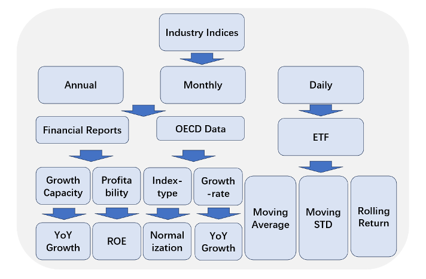
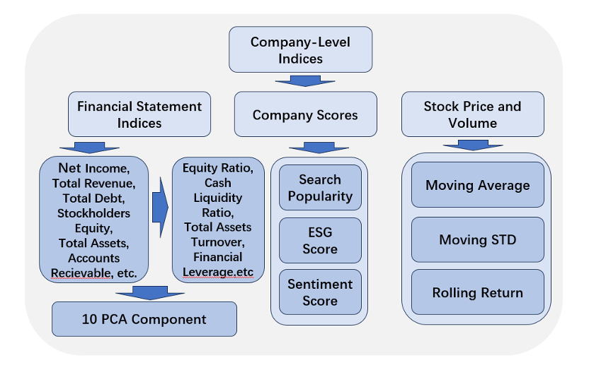
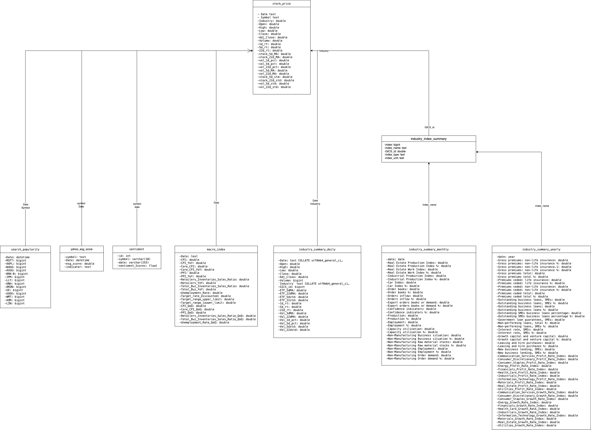
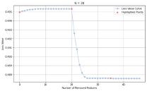
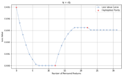
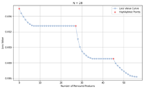
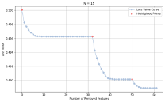

# QF5214
## Introduction

In this report, we focus on creating and leveraging a comprehensive database designed to forecast U.S. stock prices by analyzing a combination of macroeconomic indicators, industry data and company-specific indicators. Our database aggregates a wide range of data sources, including Federal Reserve Economic Data (FRED), Global Industry Classification Standards (GICS), and other proprietary datasets, to construct databases at various levels, from macro, to industry to individual stocks, to provide a solid foundation for our forecasting models.
We integrate various types of data and feature engineer them - from general economic trends to granular industry and individual stock operating metrics - to paint a detailed picture of the factors that influence stock prices. This report not only outlines the rigorous process of database construction, but also describes how we use this database for analyzing and constructing stock forecasting models.

## Data Source
### Macro Data
Recognizing the importance of macroeconomic indicators in shaping investor sentiment and stock price dynamics, we have sourced key datasets from the Federal Reserve Economic Data (FRED).
Specifically, our database incorporates five critical indexes that are instrumental in analyzing the health and trajectory of the US economy and, by extension, the US stock market. These include the Consumer Price Index (CPI) along with Core CPI, which exclude volatile food and energy prices, providing a clearer view of long-term inflation trends. Additionally, the Producer Price Index (PPI) offers insights into wholesale market conditions, while the Purchasing Managers' Index (PMI) serves as a barometer for the manufacturing sector's health. Unemployment rate figures are included to gauge labor market conditions. Lastly, forecasts of the Federal Open Market Committee (FOMC) rate are incorporated, offering valuable predictions on future monetary policy directions.

### Industry Data
The Global Industry Classification Standard (GICS) categorizes the global market into 11 sectors. We use the 11 sectors outlined by the GICS, including Information Technology, Healthcare, Financials, Energy, Consumer Discretionary, Industrials, Communication Services, Materials, Real Estate, Utilities, and Consumer Staples. Each sector is further subdivided into specific sub-industries, providing us with a comprehensive and extensive framework for analyzing and understanding the performance and trends of different industries.
Based on the GICS classification, we have gathered industry data from three primary sources:

- **OECD Statistical Data**
We have selected industry data from the Organization for Economic Co-operation and Development (OECD) statistics, focusing on key sectors such as Health Care, Industrials, Financials, and Real Estate. These indicators include Real Estate Production Index and Real Estate Work Index for the Real Estate sector; Industrial Production Index and Car Index for Industrials sector; outstanding loans, interest rates, capital investment for Financials sector, and other. By utilizing OECD data, we gain access to broader and more detailed industry information, enabling us to better analyze industry performance and trends.
- **Prosperity indicators Data for Each Industry**
Prosperity indicators are mainly used to analyze the degree of prosperity of a market. Prosperity indicators can provide investors with important information for decision-making and reference. We have constructed periodic performance indicators, which are built based on the official financial reports of individual stocks, and integrated the data of individual stocks into industry indicators through the overall method. The official financial reports cover all listed companies and contain a wealth of information.
- **ETF Data for Each Industry**
Industry ETFs are funds designed to track the performance of a basket of stocks within a specific sector. They offer investors a convenient way to invest in particular industries, covering sectors such as technology, finance, healthcare, and more. Through industry ETF data, trends, market sentiment, and risk conditions within specific industries can be observed. The reasons for incorporating industry ETF data into individual stock price prediction models include capturing industry factors, reflecting market sentiment and trends, assessing industry risk factors, and analyzing the correlation between individual stocks and their respective industries. Therefore, integrating industry ETF data can enhance the explanatory power and accuracy of prediction models, providing more reliable insights for investment decisions.

### Company operational Data
We want to select a number of representative stocks from the U.S. stock market into our database for subsequent research. First, we determine the proportion of stocks in each sector based on the market weight of the sector. Then, in each sector, we start with the stocks with the largest market weight and select them sequentially. Finally, we selected 14 stocks from 10 industries and looked for some company-level data on relevant stocks.
- **Google Search Popularity**
Search popularity of stock symbols is weekly data provided by Google Trends. It reflect market sentiment and might be predictive of stock price movements.		
- **Sentiment Score**
We retrieve daily sentiment scores for various stocks' recent three years of related news from the Alpha Vantage API, representing public sentiment.
- **ESG Score**
Yahoo's sustainability score is provided by Sustainalytics, and we can access it using the yesg package. This score is updated monthly. Its methodology was changed since November 2019, and it indicates how much a company's economic value is at risk due to ESG factors, i.e. the lower the score, the more sustainable the company is.
- **Financial Statement**
Financial Statement data is provided by Yahoo Finance, containing income statement, balance sheet and cashflow. The frequency of the data is half a year.

## Feature Engineering
### Marco Data

Trend of macroeconomic indicators could be rather important for stock price prediction since they can reveal the state of macroeconomics and further influence investors’ perspective of the future. Consequently, we calculate the year-on-year and month-on-month growth of CPI, core-CPI, PPI and PMI. 
### Industry Data

We have computed specific indices for each of the 11 sectors defined by the Global Industry Classification Standard (GICS), including Information Technology, Healthcare, Financials, Energy, Consumer Discretionary, Industrials, Communication Services, Materials, Real Estate, Utilities, and Consumer Staples. When integrating industry data, we have categorized it into three different frequency dimensions: annual, monthly, and daily, to account for variations in data frequency.
Among these, annual and monthly data include OECD data and Prosperity Indicators Data computed from financial data. Daily data includes ETF data.
- **For OECD data**
 We conducted feature engineering processing in two categories. The index-type indicators, including indices, are obtained by standardizing the original data to obtain scores on a scale of 100, serving as the index for the respective indicator. Growth-rate indicators are derived by calculating the annual growth of the original data, representing the growth situation indicator.
- **For Prosperity Indicators Data**
 We select the total assets and net profits of all S&P 500 stocks to construct the industry growth capacity and industry profitability indicators. The indicator construction method adopts the overall calculation method. The growth capacity indicator is represented by the year-on-year growth rate of net profit of all stocks in different sectors of the S&P 500. Profitability is represented by the year-on-year growth rate of Return on Equity (ROE) for all stocks in different sectors of the S&P 500.
- **For ETF data**
To measure price trend, volatility and return, we calculated 5-days, 22-days moving average and moving std, and 1-day, 5-days, 22-days rolling return.

### Company-level Data

For company-level data, we devide them into 3 categories: Financial Statement indices, company scores and stock price and volume. For Financial Statement indices, we first calculate some ratio. Since we have over 60 indicies, then conducted PCA for all the indices and derived 10 principal components. For company scores, we didn't do any additional feature engineering. For stock price and volume, we calculated 5-days, 22-days moving average and moving std, and 1-day, 5-days, 22-days rolling return.

## Schema
### Fact Table
1. Company Data

### Dimension Tables
2. search_popularity
3. yahoo_esg_score
4. sentiment
5. macro_index
6. industry_summary_daily
7. industry_summary_monthly
8. industry_summary_yearly
9. industry_index_summary

## Model Building
### Introduction
Now that we already have integrated all the features in the all_features_filled.csv file, it is time for us to apply those features to do some inspiring work. We want to predict stock returns using the total 135 features. Our first step is to clean the data, dropping features with high incompleteness and imputing NULL for completeness. After that, we eliminate features with CatBoost in case of overfitting and for limited training time. In the end, we apply the LightGBM, one of the most widely used models for stock prediction to predict one-day stock return.
### Data Cleaning
We first take a glimpse of all the features and delete the one with too much NULL to impute, “Targe_rate_discounted”. After that, we delete those columns with non-numerical values like dates and symbols as shown below.

| Drop reasons    | Deleted Features       | Type |
|:---------------:|:----------------------:|:----:|
| **NULL**            | Targe_rate_discounted  | \-   |
| **NON-NUMERICAL**  | sp_Date                | str  |
|                | fs_Date                | str  |
|                | ind_Date               | str  |
|                | fs_Symbol              | str  |
|                | sp_Symbol              | str  |
|                | ETF_Type               | str  |

Additionally, since raw data from financial statements is too much and yearly-bases, which is a rather low frequency compared to daily-based stock prices, it is very natural to drop those financial-statements-related columns. Alternatively, we calculate operational indexes like net profit margin, cash liquidity ratio, etc. Additionally, we perform principal component analysis, and select top 10 components with over 80% explainability based on financial statements of 14 stocks of past four years. 
After that, we further preprocess features to fulfill NULLs and standardize those with extreme ranges. We first impute missing values in ESG scores and sentiment scores by using KNNImputer from sklearn. We then StandardScaler from sklearn to standardize all numerical values. 
### Feature Selection
Now we have a total number of 78 features and it is significant to eliminate some to prevent overfitting and reduce training time. Consequently, we apply CatBoost for feature selection and compare model performance with different number of features reserved. After comparing between 15, 20, 30 and 45 features, we finally decide to reserve 20 features in total and the result is shown as follow.

<table>
  <tr>
    <td></td>
    <td></td>
  </tr>
  <tr>
    <td></td>
    <td></td>
  </tr>
</table>

### Regression
We have a total 20 features using CatBoost as explained in the previous part. The next step is to generate labels. Because of the limitation of our sample sizes and computational expense, instead of directly using stock return as label, we instead set a dummy variable that indicate stock movement, 1 for stock price going up and 0 for going down. 
After careful consideration, we decide to choose LightGBM, one of the most widely used due to its widespread adoption in quantitative finance and its capability to efficiently handle large datasets, providing fast training speeds and accurate predictions.
Noted that typical K-fold cross-validation is not suitable for financial time series. The reason is that a key assumption for time series cross-validation is the independent and identical distribution of the samples available for training. For financial time series, like stock price in our project, this is obviously not the case. Financial data is neither independently nor identically distributed because of serial correlation and time-varying standard deviation, also known as heteroskedasticity. Thus, we apply TimeSeriesSplit in sklearn for cross-validation.
Finally, we apply MAE and RMSE to assess the performance of our model. The result is shown as below.

|  N  | Average MAE across all folds | Test Set MAE | Test Set RMSE |
|:---:|:-----------------------------:|:------------:|:-------------:|
|  15 |           0.472976421         |    0.464096  |    0.527667   |
|  20 |           0.473411656         |    0.455062  |    0.524996   |
|  30 |           0.469230624         |    0.460116  |    0.523585   |
|  45 |           0.470335612         |    0.468228  |    0.520506   |
## Future Work
Looking ahead, our focus will be on refining our database and embracing advanced data processing techniques to enhance stock price prediction capabilities:
### Database Enhancement
-  **Real-Time Data Integration**: We plan to incorporate real-time data streams to keep our database current with market changes, increasing the timeliness and relevance of the information.
- **Diverse Data Sources**: Expanding our database to include a broader range of data types such as transactional data from exchanges, economic reports.

### Advanced Data Processing
- **Enhanced Data Handling**: We will upgrade our infrastructure to efficiently manage and process larger datasets, enabling more comprehensive analysis.
- **Machine Learning Enhancements**: Implementing more sophisticated machine learning algorithms such as deep learning or reinforcement learning could uncover deeper patterns and relationships within the data.

